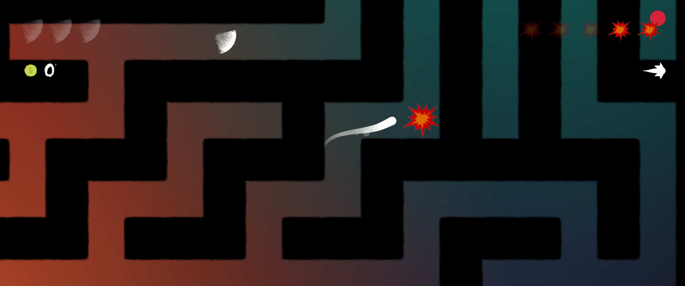
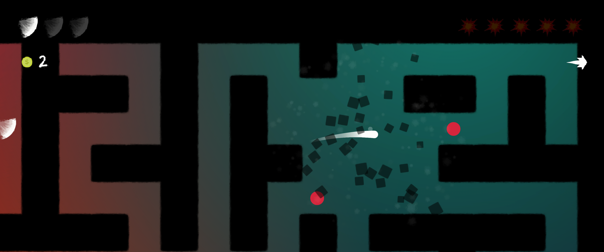

# Unity-MazeEscape

A game in Unity 2D, with procedurally generated mazes. Collect all parts of the portal to advance to next level. Use explosions (space) to create shortcuts, boost (right click) to travel faster, and evade the red enemies.

